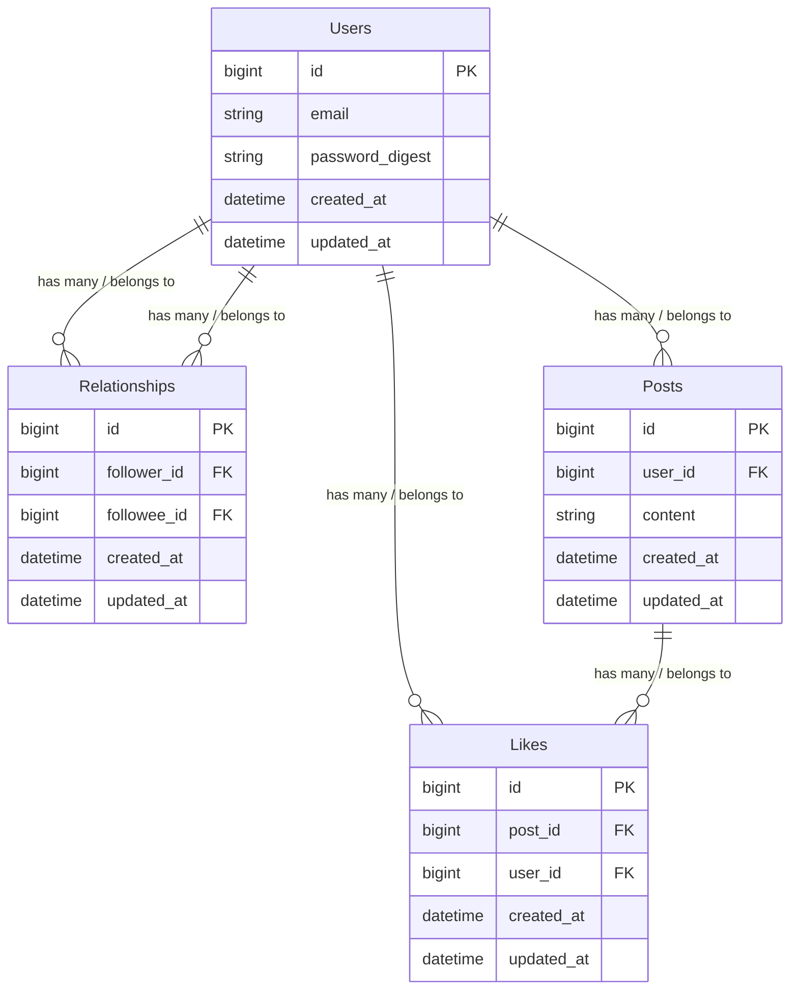

# 要件定義書
## 課題
1. 既存SNSの疲弊
  - ユーザー同士の過剰な関わりや承認欲求の競争が、心理的負担を生んでいる
  - フォロワー数や「いいね」の可視化によるプレッシャーが大きい
2. 匿名性の欠如
  - 実名や個人情報の露出が高く、自由な投稿が難しい
3. 機能の過剰化
  - 既存SNSではリプライやDMなどの複雑なコミュニケーション機能が多すぎ、手軽さが失われている

## 解決方法
1. 匿名性を最大限に保つことで、心理的負担を軽減
  - フォロワーや「いいね」の具体的な情報を非公開化
  - 匿名投稿が可能
2. ユーザー同士の直接的なコミュニケーションを排除し、「観る・楽しむ」特化のSNSを構築
  - リプライやコメント機能を廃止
3. シンプルで直感的なUI/UXを提供
  - 不要な機能を削減し、投稿と閲覧に集中できる環境を提供

## 要求
1. 投稿機能
  - 400文字以内のテキスト投稿
  - 画像やリンクの添付（オプション）
2. フォロー機能
  - フォローは匿名で行われる
  - フォローされた側はフォロワーを確認できない
  - ユーザーは、自フォロワーの総数だけ確認できる
3. いいね機能
  - 投稿への「いいね」は匿名で行われる
  - 投稿者は総数のみを確認可能
4. 検索機能
  - 投稿テキストやハッシュタグで検索可能
5. 非表示機能
  - 不快なユーザーの投稿を非表示にする

## 要件
1. ユーザー登録・認証機能
  -	メールアドレスとパスワードを利用した認証
  -	匿名性を重視した最低限の情報収集
2. 投稿機能
  -	テキスト投稿は必須、画像やリンク添付は将来的に検討
  -	投稿の削除・非公開化機能
  - 投稿の編集機能
3. フォロー機能
  -	フォロワー情報の非公開化
  -	フォロー数の確認は可能
4. いいね機能
  -	「いいね」の匿名性を維持しつつ、投稿の人気度を測定可能
5. タイムライン機能
  -	フォローしているユーザーの投稿を時系列順に表示
  -	人気投稿を表示するトレンドページを用意

## 仕様
- バックエンド
	-	フレームワーク: Ruby on Rails

- フロントエンド
	-	フレームワーク: React

- データベース
	-	MySQL

